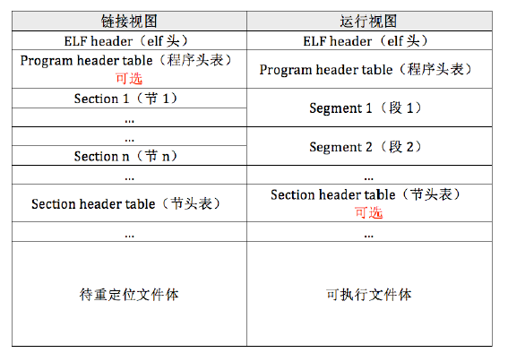

# ELF

## ELF 目标文件

ELF 指的是Executable and Linkable Format, 它是*nix系统的二进制接口(ABI)规范。把符合ELF格式的文件统称为"目标文件"，这与我们平时所说的目标文件是不同的。  
ELF目标文件包含：
- 带重定位文件(relocatable file): 就是我们常说的目标文件，经过源代码文件编译但未链接生成的文件
- 共享目标文件(shared object file): 动态链接库
- 可执行文件(executable file): 编译链接后的可直接运行的文件。
以上三种文件都是符合ELF格式的目标文件。


### ELF 格式
ELF文件包含一个头(ELF header) 和多个大小不一的段(segment/section), 这些段的大小和位置保存在程序头表（program header table）和节头表（section header table）。


#### ELF header的结构
ELF header的结构可以在Linux系统的 `/usr/include/elf.h` 找到

```c++
typedef struct
{
  unsigned char	e_ident[16];	/* Magic number and other info */
  Elf32_Half	e_type;			/* Object file type */
  Elf32_Half	e_machine;		/* Architecture */
  Elf32_Word	e_version;		/* Object file version */
  Elf32_Addr	e_entry;		/* Entry point virtual address */
  Elf32_Off	    e_phoff;		/* Program header table file offset */
  Elf32_Off	    e_shoff;		/* Section header table file offset */
  Elf32_Word	e_flags;		/* Processor-specific flags */
  Elf32_Half	e_ehsize;		/* ELF header size in bytes */
  Elf32_Half	e_phentsize;	/* Program header table entry size */
  Elf32_Half	e_phnum;		/* Program header table entry count */
  Elf32_Half	e_shentsize;	/* Section header table entry size */
  Elf32_Half	e_shnum;		/* Section header table entry count */
  Elf32_Half	e_shstrndx;		/* Section header string table index */
} Elf32_Ehdr;
```
elf header 中的数据类型
```c++
typedef uint16_t Elf32_Half;
typedef uint32_t Elf32_Word;
typedef uint32_t Elf32_Addr;
typedef uint32_t Elf32_Off;
```

程序头表的数据结构，这是用于描述各个段的信息的，这里的段是磁盘上ELF文件的段，而不是运行时的内存上的段。
```c++
typedef struct
{
  Elf32_Word	p_type;			/* Segment type */
  Elf32_Off	    p_offset;		/* Segment file offset */
  Elf32_Addr	p_vaddr;		/* Segment virtual address */
  Elf32_Addr	p_paddr;		/* Segment physical address */
  Elf32_Word	p_filesz;		/* Segment size in file */
  Elf32_Word	p_memsz;		/* Segment size in memory */
  Elf32_Word	p_flags;		/* Segment flags */
  Elf32_Word	p_align;		/* Segment alignment */
} Elf32_Phdr;
```


<!-- TODO -->
## 目标文件(二进制文件)查看工具


### objdump


### readelf


### nm

### xxd

### ar