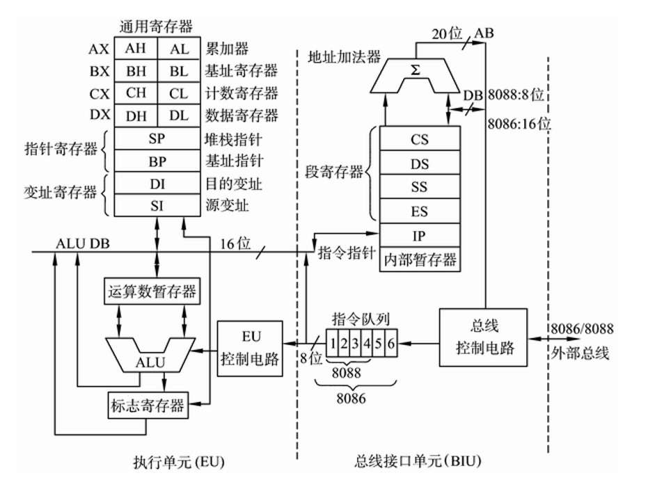
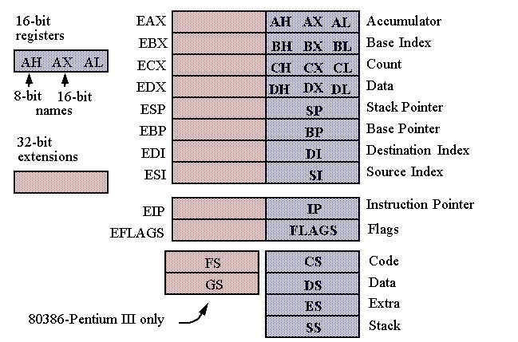

# 02 MBR主引导记录

## 一点汇编知识 
以8086CPU为例，复习一下基本的汇编知识

### 寄存器
8086CPU的架构，以及寄存器如下图所示


8086CPU 有四个16位通用寄存器，他们是可以单独的访问高八位和低八位。
段寄存器：
- CS 代码段，CS:IP 保存着当前执行的指令的地址
- SS 栈段， SP，BP 的默认段地址
- DS 数据段， DI, SI 的默认段地址
- ES 扩展段

8038CPU寄存器示意图，通用寄存器、指针寄存器以及变址寄存器是32位，段寄存器依旧是16位，但是在32位的保护模式下，段选择寄存器是作为段选择子来使用。


### 寻址方式
8086CPU的地址线是16位，但是它能够访问的最大内存地址是1MB,它是通过段地址和偏移地址实现的。
EA = 段地址:偏移地址 =  段地址 * 16 + 偏移地址

8086的寻址方式大致分为三类：
- 寄存器寻址: `mov ax, bx`
- 立即数寻址: `mov ax, 0x55aa`
- 内存寻址

其中比较复杂的是内存寻址，它有可以分为：
- 直接寻址: `mov ax, [0x1234]` 0x1234 是内存地址（偏移地址），其默认的段地址是寄存器DS,也可以指定段寄存器 `mov ax, [es:0x1234]`
- 基址寻址: `mov ax, [bp] ` 或 ` mov ax, [bx]`, 实模式下只能使用bp或bs作为基址寄存器，bp的默认段寄存器是ss,bx的默认段寄存器是ds  
- 变址寻址: 变智寻址和基址寻址类似，只是对应的偏移地址存放在 si(源地址)和di(目标地址)寄存器，`mov [di], ax` `mov [si+0x1234], ax` , 这两个寄存的默认段地址都是ds
- 基址变址寻址: `mov [bx+di], ax` `add [bx+si], ax`

### int 指令
`int`是内中断指令，在BIOS中已有一些功能代码（类似于库函数），为了方便用户使用，以内中断的形式调用对应的功能。该指令格式
```asm
int n; n表示中断编号，不同的编号对应不同的功能
```

关于编号和对应功能参考：[IBM PS 2 and PC BIOS Interface Technical Reference](https://www.ibm-pc.org/manuals/ibm/ps2/PS2_and_PC_BIOS_Interface_Technical_Reference_Apr87.pdf)


- int 0x10 中断
  
  `int 0x10` 是显示功能的中断，一个中断编号是一类功能。为了区分不同的子功能，在执行 `int n`指令是会读取寄存器AX的内容，AH 是子功能的编号，AL 是对应子功能的参数

  ```asm
  mov ax, 0x0003 ; AH=0x00  AL=0x03, 对应的功能是设置为80x25的彩色文本显示模式
  int 0x10
  ```


另外一本参考书：[PC System Programming](https://ia902906.us.archive.org/13/items/PC_System_Programming/PC_System_Programming.pdf) 附录B有详细的BIOS中断功能描述


## MBR（主引导记录）
首先明确一点，程序（包括数据）都是需要加载到内存中，CPU直接访问的是内存。实模式下1MB的内存分布如下:
| 起始 | 结束 | 大小 | 描述 |
|----| --- | --- | --- |
| F0000 | FFFFF | 64KB |  BIOS  |
| C8000 | EFFFF |  160KB |  映射硬件适配器的ROM 或内存映射式I/O |
| C0000 | C7FFF | 32KB | 显示适配器 BIOS |
| B8000 | BFFFF | 32KB | 用于文本模式显示适配器 |
| B0000 | B7FFF | 32KB | 用于黑白显示适配器 |
| A0000 | AFFFF | 64KB   | 用于彩色显示适配器 |
| 9FC00 | 9FFFF | 1KB    | EBDA（Extended BIOS Data Area）扩展BIOS 数据区 |
| 7E00  | 9FBFF | 622080B 约608KB|  **可用区域** |
| 7C00  | 7DFF  | 512B   | MBR 被BIOS 加载到此处，共512 字节|
| 500   | 7BFF  | 30464B 约30KB |  **可用区域**|
| 400   | 4FF   | 256B   | BIOS Data Area（BIOS 数据区）|
| 000   | 3FF   | 1KB    | Interrupt Vector Table（中断向量表） |

CPU上电cs:ip = 0xF000:0xFFF0, 该地址就是BIOS的地址，所以CPU执行的第一段程序就是BIOS程序。
BIOS的功能是硬件检测，BIOS在结束之前会把磁盘的第一个扇区的512字节加载到内存 0x7c00的位置，并将cs:ip设置为 0x0:0x7c00, [关于为什么是0x7c00](http://xesam.github.io/computer-BIOS-0x7C00/)

加载的第一个扇区的程序就是引导记录（MBR），它必须满足两个条件，1)这段程序总共是512个字节 2）程序的最后两个字节是 0x55 和 0xaa, 即第510字节（0x55）和511字节（0xaa）


See also:
- https://www.kinvy.cn/posts/tech/os/bios-int/
- https://www.kinvy.cn/posts/tech/os/org/