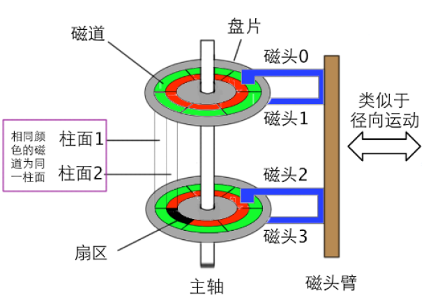
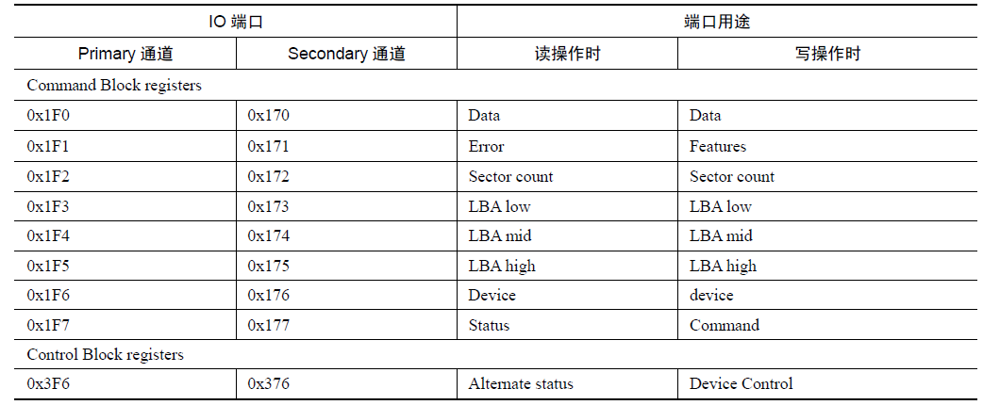

# 03 硬盘的读写

## 1. 硬盘工作原理



机械硬盘是通过盘片上的磁性物质存储信息的，读写操作是由磁头完成的。

CHS模式读写数据：磁头号、柱面号、扇区号

LBA(逻辑扇区)：扇区号

1个扇区 = 512字节

LBA28, LBA48


## 2. `in` 、`out` 指令
对于IO设备，使用 `in`从设备读入数据（状态），`out`输出数据（指令）到设备

```asm
; 0~255 端口读写
in al, 20h  ; 从指定端口号的读
out 20h, al ; 写

; 256~65535 的端口读写， 端口号存放在dx中
mov dx, 3f8h
in al, dx   ; 读一个字节
out dx, al  ; 写一个字节
```


## 3. 读写硬盘
硬盘相关的控制端口号


- 0x1F0：16bit 端口，用于读写数据
- 0x1F1：检测前一个指令的错误
- 0x1F2：读写扇区的数量
- 0x1F3：起始扇区的 0 ~ 7 位
- 0x1F4：起始扇区的 8 ~ 15 位
- 0x1F5：起始扇区的 16 ~ 23 位
- 0x1F6:
  - 0 ~ 3：起始扇区的 24 ~ 27 位
  - 4: 0 主盘, 1 从片
  - 6: 0 CHS, 1 LBA
  - 5 ~ 7：固定为1
- 0x1F7: out
  - 0xEC: 识别硬盘
  - 0x20: 读硬盘
  - 0x30: 写硬盘
- 0x1F7: in / 8bit
  - 0 ERR
  - 7 BSY 硬盘繁忙


我们读写硬盘主要使用的是Command Block registers

注：表中的通道指的是IDE的编号，即IDE0和IDE1，而每个IDE接口可以挂载两个磁盘，分别是主盘（master）和从盘（slave）


步骤：
1. 设置读取的扇区数
2. 将LBA地址存入 0x1f3~0x1f6
3. 向0x1f7端口写入读命令，0x20
4. 检测硬盘状态
5. 从0x1f0端口读取数据


```asm
; 读磁盘
read_disk:
    ; 设置读写扇区的数量
    mov dx, 0x1f2
    mov al, bl
    out dx, al

    inc dx  ; 0x1f3
    mov al, cl  ; 起始扇区的前八位
    out dx, al

    inc dx  ; 0x1f4
    shr ecx, 8
    mov al, cl;起始扇区的中八位
    out dx, al

    inc dx ; 0x1f5
    shr ecx, 8
    mov al, cl; 起始扇区的高八位
    out dx, al

    inc dx; 0x1f6
    shr ecx, 8
    and cl, 0b1111; 将高四位置为0

    mov al, 0b1110_0000
    or al, cl
    out dx, al  ; 主盘 LBA模式

    inc dx; 0x1f7
    mov al, 0x20; 读硬盘
    out dx, al

    xor ecx, ecx ; 将ecx清空
    mov cl, bl ; 得到读写扇区的数量
    
    .read:
        push cx
        call .waits ; 等待数据准备完成
        call .reads  ; 读取一个扇区
        pop cx
        loop .read
    ret 

    .waits:
        mov dx, 0x1f7
        .check:
            in al, dx
            jmp $+2; 直接跳转到下一行， 延迟
            jmp $+2
            jmp $+2
            and al, 0b1000_1000
            cmp al, 0b0000_1000
            jnz .check
        ret
    
    .reads:
        mov dx, 0x1f0
        mov cx, 256; 一个扇区256 字
        .readw:
            in ax, dx
            jmp $+2
            jmp $+2
            jmp $+2
            mov [edi], ax
            add edi, 2
            loop .readw
        ret
```

