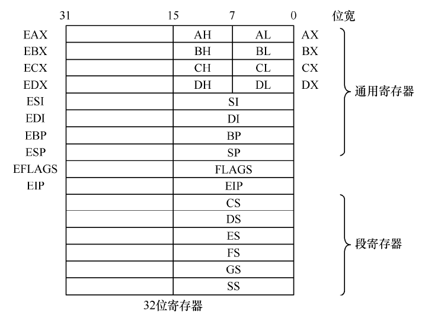
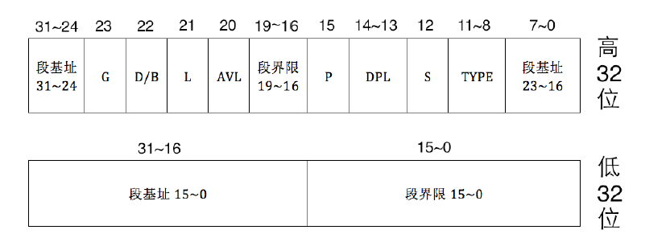

# 06 保护模式

## 1. 实模式和保护模式
实模式（16位模式）：可寻址1MB，通过段+偏移地址的方式寻址，每个段最大是64KB
保护模式（32位模式）：可寻址4GB，段选择子+基址的寻址方式

## 2. 从实模式到保护模式
保护模式下的寄存器



### 2.1 全局描述符表（GDT）
保护模式下程序内存的使用都是需要登记在一个表中，这个表叫做**全局描述符表（GDT）**，实则就是内存中一段连续的空间。
这个表的表项叫做全局描述符，其大小是8个字节，用来描述各个内存段的起始地址、大小、权限等信息。


GDT 的界限是16位的，所以，该表最大是216字节，也就是65536字节（64KB）。又因为一个描述符占8字节，故最多可以定义8192个描述符。

全局描述符：


```c++
typedef struct  /* 共 8 个字节 */
{
    unsigned short limit_low;      // 段界限 0 ~ 15 位
    unsigned int base_low : 24;    // 基地址 0 ~ 23 位 16M
    unsigned char type : 4;        // 段类型
    unsigned char segment : 1;     // 1 表示代码段或数据段，0 表示系统段
    unsigned char DPL : 2;         // Descriptor Privilege Level 描述符特权等级 0 ~ 3
    unsigned char present : 1;     // 存在位，1 在内存中，0 在磁盘上
    unsigned char limit_high : 4;  // 段界限 16 ~ 19;
    unsigned char available : 1;   // 该安排的都安排了，送给操作系统吧
    unsigned char long_mode : 1;   // 64 位扩展标志
    unsigned char big : 1;         // 32 位 还是 16 位;
    unsigned char granularity : 1; // 粒度 4KB 或 1B
    unsigned char base_high;       // 基地址 24 ~ 31 位
} __attribute__((packed)) descriptor;

descriptor gdt[8192];
```

- 段基址：32位，表示该段的基地
- 段界限：20位，段的大小，单位取决于G(粒度)
- G：Granularity粒度，0表示粒度位1字节，1表示为4KB。
  段大小=（段界限+1）* 粒度大小
- D/B ：“默认的操作数大小”（Default Operation Size）或者“默认的堆栈指针大小”（Default Stack Pointer Size），1为32bit, 0为16bit
- L：64 位代码段标志（64-bit Code Segment），保留此位给64 位处理器使用。32位模式设置为0即可。
- AVL：软件可以使用的位（Available），通常由操作系统来用，处理器并不使用它。
- P：段存在位（Segment Present），有可能声明了段，但是内存空间不足，该位被清零，P位由处理器负责检查。
- DPL：描述符的特权级（Descriptor Privilege Level，DPL）
- S：描述符的类型（Descriptor Type），0表示系统段，1表示代码段或数据段
- TYPE：段类型,4位


**目前只关注非系统就可以**
对于非系统段，按代码段和数据段划分，这 4 位分别有不同的意义
参考：《Intel Architecture Software Developer's Manual volume3》-Section3.4.1 tab3-1

| 内存段类型| X | C | R | A | 说明 |
| --- | --- | --- | ---- | ---- | --- |
|代码段| 1 | 0 | 0 | * | 只执行 |
| ... | 1 | 0 | 1 | * | 执行、可读 |
| ... | 1 | 1 | 0 | * | 执行、一致性代码段 |s
| ... | 1 | 1 | 1 | * | 执行、可读、一致性代码段 |
| **内存段类型** | **X** | **E** | **W**| **A** | **说明** |
| 数据段 | 0 | 0 | 0 | * | 只读 |
| ...   | 0 | 0 | 1 | * | 读写 | 
| ...   | 0 | 1 | 0 | * | 只读，向下扩展 |
| ...   | 0 | 1 | 1 | * | 读写，向下扩展 |

- X 表示可执行，数据段不可执行为0，代码段可执行为1
- C 表示一致性代码段，也称为依从代码段，依从代码段不需要修改特权级
- R表示可读，
- W 表示可写，
- E表示扩展方向，0向上，1向下。
- A 表示Accessed 位，这是由CPU来设置的，每当该段被CPU访问过后，CPU就将此位置1。


GDT是在内存中，由GDTR寄存器指向它所在的位置。GDTR是一个48位的寄存器，其定义如下图


```c++
typedef struct pointer {
  unsigned short limit;  // size -1
  unsigned int base;  
} __attribute__((packed)) pointer;
```

对应的汇编指令
```asm
lgdt  [gdt_ptr]; 加载gdt,  mov gdtr [gdt_ptr]
sgdt  [gdt_ptr]; 保存gdt   mov [gdt_ptr] gdtr
```


注： GDT的第一个位置（即第0个）描述符是不可用的，必须全为0。

## 2.2 段选择子
在实模式下，段寄存器存放的是段基址。在保护模式下，段寄存器依旧是16位的，但是它被称作段选择子，其结构如下图：


cs / es / ds / ss , gs / fs

```c++
typedef struct selector {
  unsigned char RPL : 2;
  unsigned char TI : 1;
  unsigned short index : 13;
} __attribute__((packed)) selector;
```

- 描述符索引：13位，即描述符在描述符表的位置，13位表示的最大数值是8192，其大小就是描述符表最大的容量
- TI：描述符表指示器，0表示描述符在全局描述符表（GDT），1表示在局部描述符表（LDT）
- RPL：请求特权级，2bits,表示4特权级，从0~3依次降低，0是最高权限，3是最低的权限


## 2.3 A20线
参考： [https://wiki.osdev.org/A20_Line](https://wiki.osdev.org/A20_Line)

8086的地址线是20bit，内存最大支持1MB，286处理器的地址线是24bit，寻址空间是16MB。为了向后兼容，使得8086的程序可以在80286甚至是在80386的处理器上运行，我们必须使A20线置为0，这样可达到地址环回的作用。
反过来，我们要从实模式到保护模式，就要开启A20地址线，使其能够访问到更多内存空间。

一种打开A20的方式：
```asm
in al, 0x92
or al, 0000_0010B
out 0x92, al
```

## 2.4 CR0 寄存器
CR0 是一系列控制寄存器CRx中的一个，CR0寄存器的各位表示如下图


目前我们只需要关注第0位，保护模式使能位，1表示使能保护模式。

```asm
mov eax, cr0
or  eax, 0x0000_0001
mov cr0, eax 
```


注意，开启PE后还是需要做一些准备工作，同时也是实模式的收尾工作：
- 刷新段寄存器，包括它们的段选择器和描述符高速缓存器
- 清空流水线上的指令

## 2.5 步骤总结
从实模式到保护模式的大致步骤总结
1. 设置GDT
2. 打开A20
3. 加载GDT
4. CR0的0位置1，使能PE


